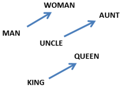
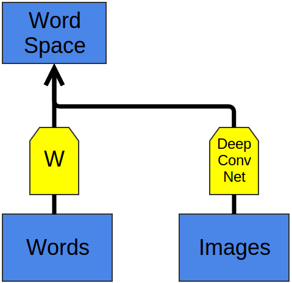

Introduction
------------

A lot of problems in machine learning are about trying to learn a function on a high-dimensional space. We have a set of data points for which we know what value the function should take. For example, we might be trying to classify images -- which we can interpret as vectors -- given a set of images for which we know their classes.

For example, consider the following 2-dimensional points. The are in two classes, red and blue. If we had an unknown point somewhere on the plane, which class should that be?

One option would be to go with the class of the closest known point. (This is a very simple version of a technique called [nearest neighbors](http://en.wikipedia.org/wiki/Nearest_neighbour_algorithm).)

One Hidden Layer Neural Networks
---------------------------------

A neural network with a hidden layer has universality: given enough hidden units, it can approximate any function. This is a frequently quoted -- and even more frequently, misunderstood and applied -- theorem.

It's true, essentially, because the hidden layer can be used as a lookup table.

For simplicity, let's consider a perceptron network. A [perceptron] is a very simple neuron that fires if it exceeds a certain threshold and doesn't fire if it doesn't reach that threshold. A perceptron network gets binary (0 and 1) inputs and gives binary outputs.

Note that there are only a finite number of inputs. For each possible input, we can construct a neuron in the hidden layer that fires for that input, and only on that specific input. Then we can use the connections between that neuron and the output neurons to control the output in that specific case.

Constructing a case for every possible input requires $2^n$ hidden neurons, when you have $n$ input neurons. In reality, the situation isn't usually that bad. You can have cases that encompass multiple inputs. And you have can have overlapping cases that add together to achieve the right input on their intersection.

(It isn't only perceptron networks that have universality. Networks of sigmoid neurons (and other activation functions) are also universal: give enough hidden neurons, they can approximate any continuous function arbitrarily well. Seeing this is significantly trickier because you can't just isolate inputs.)

And so, it's true that one hidden layer neural networks are universal. But there isn't anything particularly impressive or exciting about that. Saying that your model can do the same thing as a lookup table isn't a very strong argument for it. You're just saying it isn't literally impossible for your model to do the task.

Universality means that a network can fit to any training data you give it. It doesn't mean that it will interpolate to new data points in a reasonable way.

There seems, in fact, to be something very powerful about neural networks. But it's much more subtle than universality and it seems to require networks with many layers.

[perceptron]: http://en.wikipedia.org/wiki/Perceptron

Word Embeddings
-----------------

I'd like to change courses for a minute and trace a particularly interesting strand of deep learning research: word embeddings. In my personal opinion, word embeddings are probably the most exciting area of research in deep learning at the moment. Beyond that, I think they are one of the best places to gain intuition about why deep learning is so effective.

A word embedding $W: \mathrm{words} \to \mathbb{R}^n$ is a paramaterized function mapping words in some language to high-dimensional vectors (perhaps 200 to 500 dimensions). For example, we might find:

$$W(``\text{cat}\!") = (0.2,~ \text{-}0.4,~ 0.7,~ ...)$$

$$W(``\text{mat}\!") = (0.0,~ 0.6,~ \text{-}0.1,~ ...)$$

(Typically, the function is a lookup table, parameterized by a matrix, $\theta$, with a row for each word: $W_\theta(w_n) = \theta_n$.)

$W$ is initialized to have random vectors for each word. It learns to have meaningful vectors in order to perform some task.

For example, one task we might train a network for is predicting whether a 5-gram (sequence of five words) is 'valid.' We can easily get lots of 5-grams from Wikipedia (eg. "cat sat on the mat") and then 'break' half of them by switching a word with a random word (eg. "cat sat **song** the mat"), since that will almost certainly make our 5-gram nonsensical.

Modular Network to determine if a 5-gram is 'valid' (From Bottou (???))  

The model we train will run each word in the 5-gram through $W$ to get a vector representing it and feed those into another 'module' called $R$ which tries to predict if the 5-gram is 'valid' or 'broken.' Then, we'd like:

$$R(W(``\text{cat}\!"),~ W(``\text{sat}\!"),~ W(``\text{on}\!"),~ W(``\text{the}\!"),~ W(``\text{mat}\!")) = 1$$

$$R(W(``\text{cat}\!"),~ W(``\text{sat}\!"),~ W(``\text{song}\!"),~ W(``\text{the}\!"),~ W(``\text{mat}\!")) = 0$$

In order to predict these values accurately, the network needs to learn good parameters for both $W$ and $R$.

Now, this task isn't terribly interesting. Maybe it could be helpful in detecting grammatical errors in text or something. But what is extremely interesting is $W$. 

(In fact, to us, the entire point of the task is to learn $W$. We could have done several other tasks -- another common one is predicting the next word in the sentence. But we don't really care. In the remainder of this section we will talk about many word embedding results and won't distinguish between different approaches.)

One thing we can do to get a feel for the word embedding space is to visualize them with t-SNE, a sophisticated technique for visualizing high-dimensional data.

t-SNE visualizations of word embeddings. Left: Number Region; Right: Jobs Region. From [Turian *et al.*], see [complete image](http://metaoptimize.s3.amazonaws.com/cw-embeddings-ACL2010/embeddings-mostcommon.EMBEDDING_SIZE=50.png).

This kind of 'map' of words makes a lot of intuitive sense to us. Similar words are close together. Another way to get at this is to look at which words are closest in the embedding to a given word. Again, the words tend to be quite similar.

What words have embeddings closest to a given word? From [Colbert *et al.* (2011)](http://arxiv.org/pdf/1103.0398v1.pdf) 

It seems natural for a network to make words with similar meanings have similar vectors. If you switch a word for a synonym (eg. "a few people sing well" $\to$ "a *couple* people sing well"), the validity of the sentence doesn't change. While, from a naive perspective, the input sentence has changed a lot, if $W$ maps synonyms (like "few" and "couple") close together, from $R$'s perspective little changes.

This is very powerful. The number of possible 5-grams is massive and we have a comparatively small number of data points to try to learn from. Similar words being close together allows us to generalize from one sentence to a class of similar sentences. This doesn't just mean switching a word for a synonym, but also switching a word for a word in a similar class (eg. "the wall is blue" $\to$ "the wall is *red*"). Further, we can change multiple words (eg. "the wall is blue" $\to$ "the *ceiling* is *red*"). The impact of this is exponential with respect to the number of words.

So, clearly this is a very useful thing for $W$ to do. But how does it learn to do this? It seems quite likely that there are lots of situations where it has seen a sentence like "the wall is blue" and know that it is valid before it sees a sentence like "the wall is red". As such, shifting "red" a bit closer to "blue" makes the network perform better.

We still need to see examples of every word being used, but the analogies allow us to generalize to new combinations of words. You've seen all the words that you understand before, but you haven't seen all the sentences that you understand before. So too with neural networks.

From [Mikolov *et al.* (2013)](https://www.aclweb.org/anthology/N/N13/N13-1090.pdf) 

Word embeddings exhibit an even more remarkable property: analogies between words seem to be encoded in the difference vectors between words. For example, there seems to be a constant male-female difference vector:

$$W(``\text{woman}\!") - W(``\text{man}\!") ~\simeq~ W(``\text{aunt}\!") - W(``\text{uncle}\!")$$
$$W(``\text{woman}\!") - W(``\text{man}\!") ~\simeq~ W(``\text{queen}\!") - W(``\text{king}\!")$$

This may not seem too surprising. After all, gender pronouns mean that switching a word can make a sentence grammatically incorrect. You write, "*she* is the aunt" but "*he* is the uncle." Similarly, "*he* is the King" but "*she* is the Queen." If one sees "*she* is the *uncle*," the most likely explanation is a grammatical error. If words are being randomly switched half the time, it seems pretty likely that happened here.

"Of course!" We say with hindsight, "the word embedding will learn to encode gender in a consistent way. In fact, there's probably a gender dimension. Same thing for singular vs plural. It's easy to find these trivial relationships!"

It turns out, though, that much more sophisticated relationships are also encoded in this way. It seems almost miraculous!

Relationship pairs in a word embedding. From [Mikolov *et al.* (2013b)](http://arxiv.org/pdf/1301.3781.pdf).

It's important to appreciate that all of these properties of $W$ are *side effects*. We didn't try to have similar words be close together. We didn't try to have analogies encoded with difference vectors. All we tried to do was perform a simple task, like predicting whether a sentence was valid. These properties more or less popped out of the optimization process.

This seems to be a great strength of neural networks: they learn better ways to represent data, automatically. Representing data well, in turn, seems to be essential to success at many machine learning problems. Word embeddings are just a particularly striking example of learning a representation.

Shared Representations
----------------------

The properties of word embeddings are certainly interesting, but can we do anything useful with them? Besides predicting silly things, like whether a 5-gram is 'valid'?

$W$ and $F$ learn to perform task A. Later, $G$ can learn to perform B based on $W$.

We learned the word embedding in order to do well on a simple task, but based on the nice properties we've observed in word embeddings, you may suspect that they could be generally useful in NLP tasks. In fact, word representations like these are extremely important:

> The use of word representations... has become a key "secret sauce" for the success of many NLP systems in recent years, across tasks including named entity recognition, part-of-speech tagging, parsing, and semantic role labeling. ([Luong *et al.* (2013)](http://nlp.stanford.edu/~lmthang/data/papers/conll13_morpho.pdf))

This general tactic -- learning a good representation on a task A and then using it on a task B -- is one of the major tricks in the Deep Learning toolbox. It goes by different names depending on the details: pretraining, transfer learning, and multi-task learning. One of the great strengths of this approach is that it allows the representation to learn from more than one kind of data.

There's a counterpart to this trick. Instead of learning a way to represent one kind of data and using it to perform multiple kinds of tasks, we can learn a way to map multiple kinds of data into a single representation!

One nice example of this is a bilingual word-embedding, produced in Socher *et al.* (2013). We can learn to embed words from two different languages in a single, shared space. In this case, we learn to embed English and Mandarin Chinese words in the same space.

We train two word embeddings, $W_{en}$ and $W_{zh}$ in a manner similar to how we did above. However, we know that certain English words and Chineses words have similar meanings. So, we optimize for an additional property: words that we know are close translations should be close together.

Of course, we observe that the words we knew had similar meanings end up close together. Since we optimized for that, it's not surprising. More interesting is that words we *didn't know* were translations end up close together.

In light of our previous experiences with word embeddings, this may not seem too surprising. Word embeddings pull similar words together, so if an English and Chinese word we know to mean similar things are near each other, their synonyms will also end up near each other. We also know that things like gender differences tend to end up being represented with a constant difference vector. It seems like forcing enough points to line up should force these difference vectors to be the same in both the English and Chinese embeddings. A result of this would be that if we know that two male versions of words translate to each other, we should also get the female words to translate to each other.

Intuitively, it feels a bit like the two languages have a similar 'shape' and that by forcing them to line up at different points, they overlap and other points get pulled into the right positions.

t-SNE visualization of the bilingual word embedding. Green is Chinese, Yellow is English. (Socher *et al.* (2013))

In billingual word embeddings, we learn a shared representation for two very similar kinds of data. But we can also learn to embed very different kinds of data in the same space.

Recently, deep learning has begun exploring models that embeds images and words in a single representation. One extremely exciting result is Frome *et al* (2013)'s deep visual-semantic embedding model (DeViSE).

Again, we train a word embedding.

We also train a deep convolutional neural network. Deep convolutional neural networks are a class of neural network that achieves outstanding results on computer vision. Starting with Krizehvsky *et al* (2012) winning ILSVRC 2012, deep conv nets have, frankly, blow prior image classification results out of the water. Frome *et al* use a derivative of the Krizhevsky network and train it to classify images into 1000 classes.

A deep convolutional neural network takes an image and, over the course of many layers, builds up more and more abstract representations of the image, starting with detecting edges, color contrasts and textures. Finally, at the end, it assigns a probability to the image being each one of a thousand classes. In the Krizhevsky network, the highest level representation of the image before it gives its answer is a 4,096 dimensional vector.

Now it's time to merge the representations! The image representation has 4,096 dimensions. Word representations are typically much lower-dimensional -- in this case, 500 or 1000 dimensions. So we project the image representation into the word representation.

